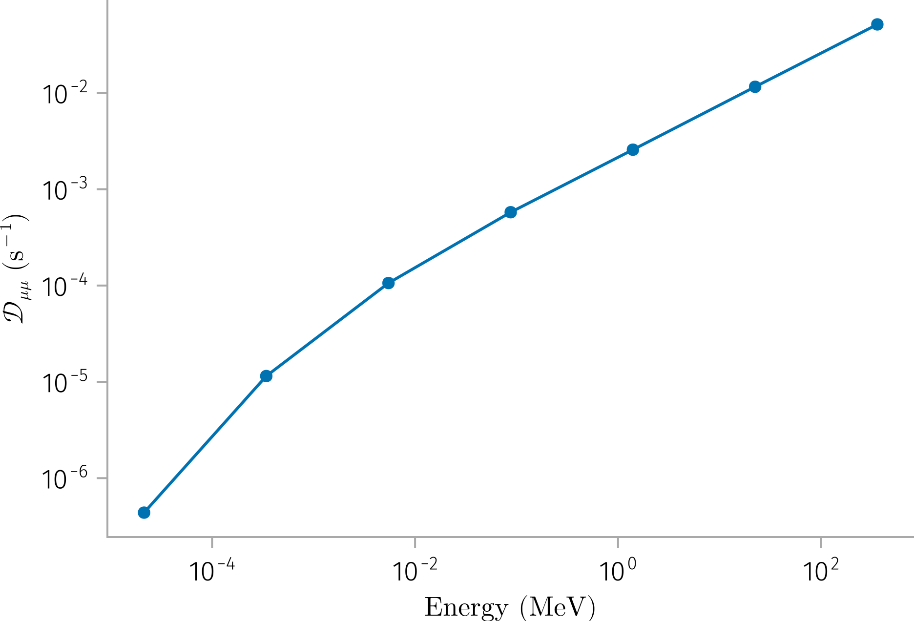

## velocity dispersion analysis (VDA)

```{julia}
using Unitful
using Unitful: c
H(B, L; q=Unitful.q, m=Unitful.mp) = (q * B * L)^2 / (2 * m * c^2) |> u"kg*km^2/s^2"

H(1u"Gauss", 2e3u"km")
```

## gyro-radius

Compare the gyro-radius of energetic particles with 1AU.

```{julia}
include("../src/utils.jl")
include("../src/diffusion.jl")
using Unitful
using Unitful: Energy
using Unitful: mp, me

@info gyroradius(100u"nT", 1u"MeV") / 1u"AU" |> upreferred
@info gyroradius(10u"nT", 1u"GeV") / 1u"AU" |> upreferred
```

<!-- [ Info: 9.659024805622024e-6 -->
<!-- [ Info: 0.00030544518361830757 -->

## Field lines

```{julia}
using CairoMakie
using CurrentSheetTestParticle: RotationalDiscontinuity, solve_fl, OutOfDomainZ

f = Figure()
ax = Axis3(f[1, 1])
isoutofdomain = OutOfDomainZ(5)
u0 = [0, 0, 0]

colors = Makie.wong_colors()
styles = [:solid, :dash, :dot, :dashdot, :dashdotdot]
for (iθ, θ) in enumerate([10, 30, 60])
    for (iβ, β) in enumerate([30, 60, 90])
        plot = (color=colors[iθ], linestyle=styles[iβ])
        B = RotationalDiscontinuity(; β, θ)
        sol = solve_fl(u0, B; tspan=(0, 100), isoutofdomain)
        sol2 = solve_fl(u0, B; tspan=(0, -100), isoutofdomain)
        label_str = "θ=$θ, β=$β"
        lines!(sol; idxs=(1, 2, 3), plot..., label=label_str)
        lines!(sol2; idxs=(1, 2, 3), plot..., label=nothing)
    end
end
axislegend(ax, position=:rt)
f
```

## Long-term behavior of pitch angle distribution


## Parallel diffusion

@chenParallelDiffusionCoefficient2024

```{julia}
"""
where r and E are in the units of au and keV, respectively.
"""
function κ_parallel(r::Integer, E::Real, ::Val{Chen24})
    # Coefficients from the formula
    kappa_base = 5.16e18 * u"cm^2/s"     # Base value of kappa
    kappa_error = 1.22e18 * u"cm^2/s"    # Uncertainty in kappa base value
    r_exponent = 1.17
    r_exponent_error = 0.08    # Uncertainty in r exponent
    E_exponent = 0.71
    E_exponent_error = 0.02    # Uncertainty in E exponent
    return kappa_base * r^r_exponent * E^E_exponent
end

κ_parallel(r::Integer, E::Energy, ::Val{Chen24}) = κ_parallel(r, NoUnits(E / u"keV"), Val(Chen24))
```


## Perpendicular diffusion

- Quasi-linear theory of Jokipii (1966), 


- Classical scattering

$$
\frac{κ_⊥}{κ_{\|}}=\frac{1}{1+(λ_{\|} / r_g)^2}
$$

where $λ_{\|}$ is the parallel mean free path and $r_g$ is the particle  Larmor radius.

```{julia}
function κ_perp(E, B::BField, ::Val{Classical}; m=mp)
    κ_para = κ_parallel(1, E, Val(Chen24))
    κ_para / (1 + (λ_parallel(κ_para, E; m) / gyroradius(B, E; m))^2)
end
```

## Summary

```{julia}
# make a table
function create_df(Es; B=10u"nT", m=mp)
    df = DataFrame(
        E=Es,
        D_μμ=D_μμ.(Es),
        gyroradius=gyroradius.(B, Es; m),
        κ_para_Discontinuity=κ_parallel.(vs, Val(Discontinuity)),
        κ_para_Chen24=κ_parallel.(1, Es, Val(Chen24)),
        κ_perp_Classical=κ_perp.(Es, B, Val(Classical); m),
        κ_perp_Discontinuity=κ_perp.(Es),
    )

    df.λ_para = λ_parallel.(df.κ_para_Chen24, df.E; m)
    df.κ_perp_FL = 0.05 * df.κ_para_Chen24
    df.gyroradius_norm = df.gyroradius / 1u"AU" .|> upreferred
    df
end

df = create_df(Es)
```

```{julia}
using Beforerr
using CairoMakie
using LaTeXStrings
import Beforerr: lstring
using Match

const EUnit = u"MeV"
const κUnit = u"cm^2/s"
const DμμUnit = u"s^-1"
@derived_dimension DiffusionCoefficient dimension(κUnit)
@derived_dimension PitchAngleDiffusionCoefficient dimension(DμμUnit)

pstrip(E::Energy; u=EUnit) = ustrip(u, E)
pstrip(κ::DiffusionCoefficient; u=κUnit) = ustrip(u, κ)
pstrip(Dμμ::PitchAngleDiffusionCoefficient; u=DμμUnit) = ustrip(u, Dμμ)

label(x) = @match x begin
    :E => L"Energy $(%$(lstring(EUnit)))$"
    :κ => L"κ $(%$(lstring(κUnit)))$"
    :Dμμ => L"𝒟_{μμ} $(%$(lstring(DμμUnit)))$"
end

data(x) = @match x begin
    :E => pstrip.(df.E)
    :κ => pstrip.(df.κ_para_Chen24)
    :Dμμ => pstrip.(df.D_μμ)
end
```

### Pitch angle diffusion plot

```{julia}
# update_theme!(Beforerr.theme_pub(; width=6.5))
let x = :E, y = :Dμμ
    fig = Figure()
    ax = Axis(fig[1, 1],
        xscale=log10, yscale=log10,
        xlabel=label(x), ylabel=label(y)
    )

    scatterlines!(data(x), data(y))
    easy_save("D_μμ")
end
```



```{julia}
function plot_diffusion(df; x=:E, y=:κ, add_perp=true)
    E = pstrip.(df.E)
    fig = Figure()
    ax = Axis(fig[1, 1],
        xscale=log10, yscale=log10,
        xlabel=label(x), ylabel=label(y)
    )

    scatterlines!(E, pstrip.(df.κ_para_Chen24), label=L"κ_∥ (Chen24)")
    scatterlines!(E, pstrip.(df.κ_para_Discontinuity), label=L"κ_∥ (Discontinuity)", linewidth=4)

    if add_perp
        scatterlines!(E, pstrip.(df.κ_perp_Discontinuity), label=L"κ_⊥ (Discontinuity)", linewidth=4)
        scatterlines!(E, pstrip.(df.κ_perp_Classical), label=L"κ_⊥ (Classical)")
        scatterlines!(E, pstrip.(df.κ_perp_FL), label=L"κ_⊥ (FL)")
    end

    axislegend(ax, position=:lt)
    fig
end

plot_diffusion(df)
```

```{julia}
plot_diffusion(df; add_perp=false)
easy_save("para_diffusion")
```

```{julia}
plot_diffusion(df_me)
```
