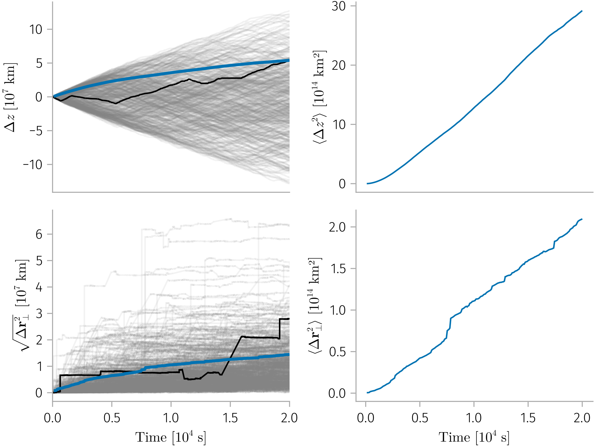
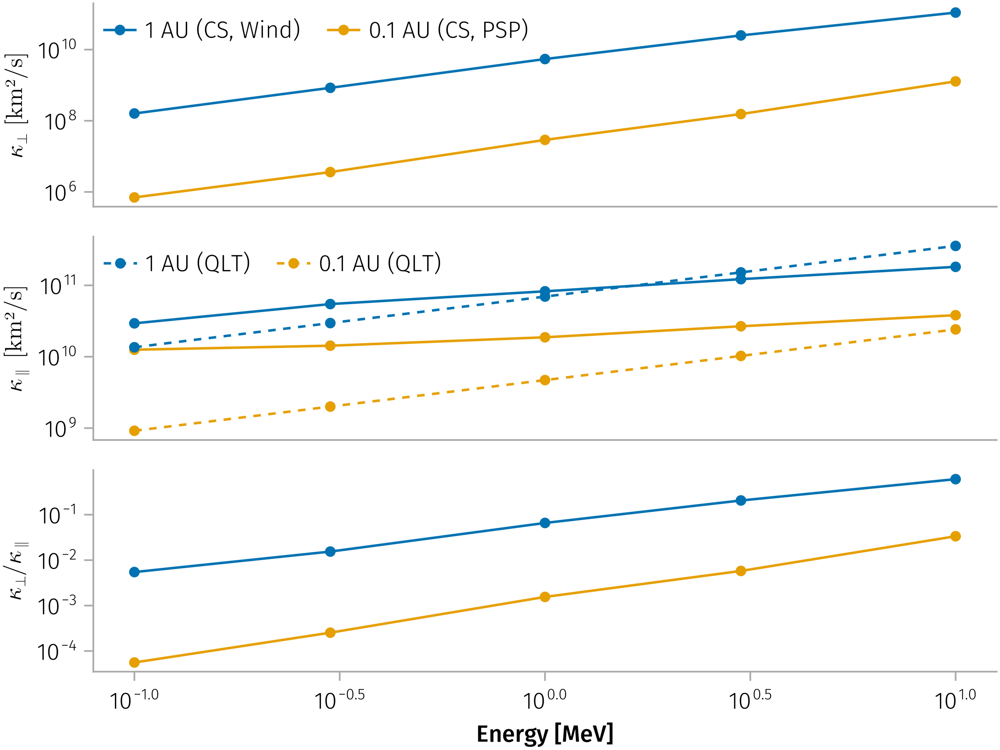

# Long-term behavior using Monte Carlo

@aguedaModelingEffectsPitchangle2005, @magdziarzCompetitionSubdiffusionLevy2007

## Basic Usage

```{julia}
using DataFramesMeta
using Unitful
using zhangEvolutionSolarWind2025
using CurrentSheetTestParticle: RotationalDiscontinuity
includet("../src/main.jl")

df = zhangEvolutionSolarWind2025.load("Wind")
psp_df = zhangEvolutionSolarWind2025.load("PSP")

gap(df.t_us, 400.0u"km/s"), gap(psp_df.t_us, 300.0u"km/s")
```

```{julia}
using ParticlesTransport
using ParticlesTransport: simulate_particle

max_time = 2e4u"s"
l = 2 * 60 * 400.0u"km" # [km], assume 400 km/s and 4 min waiting time
energies = (100u"keV", 300u"keV", 1u"MeV", 3u"MeV", 10u"MeV")

wind_sampler = build_sampler(df)
psp_sampler = build_sampler(psp_df)

wind_results = map(energies) do e
    produce(Experiment(; e, l, id="Wind", n=512), wind_sampler)["trajs"]
end

l_psp = 25000.0u"km"
psp_results = map(energies) do e
    produce(Experiment(; e, l=l_psp, id="PSP", n=512), psp_sampler)["trajs"]
end
```

### Benchmark

```{julia}
Random.seed!(1234)
vp = 4096.0u"km/s"
# simulate_particle(csi, l, vp, max_time)
@b simulate_particle(sampler, l, vp, max_time) evals = 1
# 698.292 ms (123208 allocs: 8.893 MiB)
```

## Particle trajectories

```{julia}
using Beforerr
using CairoMakie
include("../src/plot.jl")

update_theme!(; figure_padding=2)

plot_state_trajectories(wind_results[3], max_time)
easy_save("trajectories_1MeV")
```



```{julia}
# Plot trajectory
using Accessors
include("../src/plot.jl")
f = Figure(; size=(1800, 800))
Label(f[0, 1], "vp = 4096 km/s"; tellwidth=false)
Label(f[0, 2], "vp = 8192 km/s"; tellwidth=false)
Label(f[0, 3], "vp = 16384 km/s"; tellwidth=false)
plot_state_trajectories(f[1, 1], vps_trajs[1])
plot_state_trajectories(f[1, 2], vps_trajs[2])
plot_state_trajectories(f[1, 3], vps_trajs[3])
f
```

#### Estimate diffusion coefficient

From the mean squared displacement, we can estimate the perpendicular diffusion coefficient:

```{julia}
includet("../src/diffusion.jl")

wind_dcs = estimate_diffusion_coefficient.(wind_results, max_time) |> collect |> FieldViewable
psp_dcs = estimate_diffusion_coefficient.(psp_results, max_time) |> collect |> FieldViewable

au1_κ_parallels = κ_parallel.(1, energies, Val(Chen24))
au01_κ_parallels = κ_parallel.(0.1, energies, Val(Chen24))

_κ(κ) = upreferred(κ / 1u"km^2/s")
_E(e) = upreferred(e / 1u"MeV")

fig = Figure()
let plot! = scatterlines!
    axis = (; xscale=log10, yscale=log10)
    x = _E.(collect(energies))
    ax1 = Axis(fig[1, 1]; ylabel=L"$κ_⊥$ [km²/s]", axis...)
    p1 = plot!(ax1, x, collect(_κ.(wind_dcs.κ_perp)); label="1 AU (CS, Wind)")
    p3 = plot!(ax1, x, collect(_κ.(psp_dcs.κ_perp)); label="0.1 AU (CS, PSP)")
    axislegend(ax1; position=:lt, nbanks=2)

    ax2 = Axis(fig[2, 1]; ylabel=L"$κ_∥$ [km²/s]", axis...)
    plot!(ax2, x, collect(_κ.(wind_dcs.κ_para)))
    plot!(ax2, x, collect(_κ.(psp_dcs.κ_para)))
    plot!(ax2, x, collect(_κ.(au1_κ_parallels)); label="1 AU (QLT)", linestyle=:dash, color=Cycled(1))
    plot!(ax2, x, collect(_κ.(au01_κ_parallels)); label="0.1 AU (QLT)", linestyle=:dash, color=Cycled(2))
    axislegend(ax2; position=:lt, nbanks=2)
    # ylims!(ax2, (8e8, 2e12))

    ax3 = Axis(fig[3, 1]; xlabel=𝐋.E, ylabel=L"$κ_⊥ / κ_∥$", axis...)
    plot!(ax3, x, collect(wind_dcs.κ_perp ./ wind_dcs.κ_para))
    plot!(ax3, x, collect(psp_dcs.κ_perp ./ psp_dcs.κ_para))
    hidexdecorations!.((ax1, ax2))
end

easy_save("diffusion")
```




### Comparing with analytical diffusion coefficients

Compare Monte Carlo results with analytical predictions:

```{julia}
include("../src/diffusion.jl")

# Get analytical perpendicular diffusion coefficient
E = energy(v)
κ_perp_analytical = κ_perp(E) |> u"m^2/s"

# Compare with Monte Carlo estimate
println("Monte Carlo κ_⊥ = $(κ_perp * 1u"m^2/s")")
println("Analytical κ_⊥ = $(κ_perp_analytical)")
println("Ratio = $(κ_perp * 1u"m^2/s" / κ_perp_analytical)")
```
