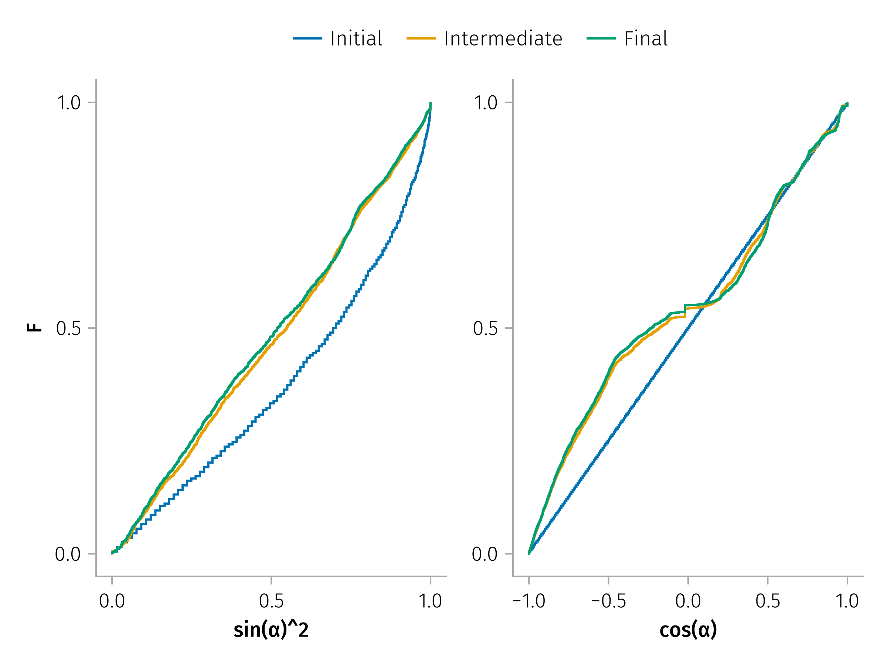
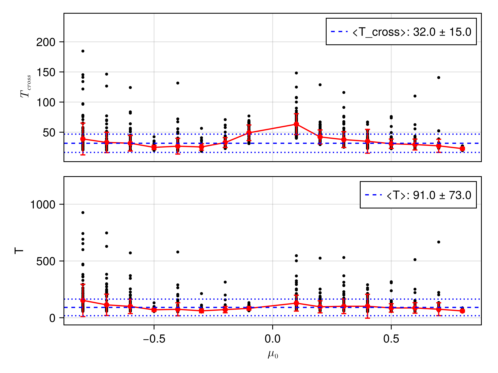
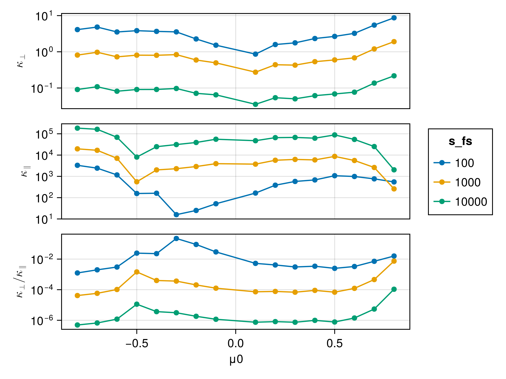

---
execute:
  eval: false
---


## Analysis

The total time between two consecutive current sheet encounters is modeled as the sum of the time spent inside the current sheet $T_{cs}$, and the time spent free-streaming between sheets $T_{fs}$, given by:

$$
T = T_{cs} + T_{fs}, \quad T_{fs} = \frac{s_{fs}}{|v_{∥,1}|}
$$

where $v_{∥,0}$, $v_{∥,1}$ are the particle's changed parallel velocity before and after interacting with the current sheet, respectively.

In the absence of scattering, the particle would follow the field line and travel a distance:

$$
s_0 = |v_{∥,0}| \cdot T = |v_{∥,0}| \left( T_{cs} + T_{fs} \right).
$$

However, when scattering occurs, the total parallel distance traveled relative to the starting point becomes:

$$
s = \text{Sign} \cdot s_{fs} + \frac{1 + \text{Sign}}{2} s_{cs}^*
$$

where $\text{Sign} = \text{sign}\left(\frac{v_{∥,1}}{v_{∥,0}}\right)$ equals to $-1$ for particle reflection and $1$ for particle crossing.

Approximately, $T_{fs} \approx s_{fs}/ |v_{∥,1}|$

Under the approximation that $s_{cs}^* << s_{fs}$, where $s_{cs}^*$ is the effective parallel distance the particle travels within the current sheet. The net displacement compared to the unperturbed case is then:

$$
Δ s_∥ = s - s_0 = s_{fs} \left(\text{Sign} - \frac{|v_{∥,0}|}{|v_{∥,1}|} \right) + \frac{\text{Sign} + 1 }{2} s_{cs}^* - |v_{∥,0}| T_{cs}
$$

This displacement depends on particle initial pitch-angle $\mu_0 = \cos α_0$ and gyrophase $\varphi_0$.

To analyze the average displacement resulting from multiple interactions with a current sheet, we begin by examining how the pitch-angle $\mu=\cos α$ is distributed following successive encounters.

$$
P(α) dα = d(\sin^2 α) => P(α) = 2\sin α |\cos α|
$$



This distribution provides a basis for computing the weighted average of both the perpendicular and parallel displacements.

Given $\mu=\cos α$, we have:

$$
\int_{0}^{\pi} Δ s_∥ |\cos α| \sin^2 α dα = \int_{-1}^{1} Δ s_∥ |\mu| \sqrt{1-\mu^2} d\mu
$$

For discrete samples $\mu_i$, we have:

$$
\overline{Δ s_∥} =  \sum_i w_i Δ s_{∥,i}  / \sum w
$$

where $w_i = |\mu_i| \sqrt{1-\mu_i^2}$.

Current sheets of left-hand or right-hand polarity have symmetry in perpendicular displacements.

Assuming that both occur with equal probability, due to this symmetry, the net average perpendicular transport vanishes, yielding a mean perpendicular displacement of zero.

This polarity does not influence the parallel displacement.

$$
\overline{Δ s_⊥} = 0
$$




The parallel spatial diffusion coefficient is then expressed as:

$$
κ_∥ = \sqrt{\frac{1}{\sum{w}} \sum_{i=1}^n {w_i  \frac{(Δ s_{∥,i} - \overline{Δ s_∥})^2}{T_i} }}
$$

Similarly, for the perpendicular direction:

$$
κ_⊥ = \sqrt{\frac{1}{\sum{w}} \sum_{i=1}^n {w_i  \frac{(Δ s_{⊥,i} - \overline{Δ s_⊥})^2}{T_i} }}
$$

where $T_i = T_{cs, i} + | s_{fs} / v_{∥,1,i} |$.

$l_0 =3 \times 10^3 \text{ km}$

$κ_0 = l_0^2 / t_0 \approx 10^7 \text{ km}^2 \text{ s}^{-1}$

The standard deviations of both parallel and perpendicular displacements increase with the shear angle. Notably, the perpendicular standard deviation is more strongly influenced by the ratio of the particle gyroradius to the current sheet thickness, indicating a greater sensitivity to the scale of the magnetic structure relative to the particle’s gyro-motion.

The key parameters—$v_{∥,1}$, $T_{cs}$, $Δ s_\perp$, and $Δ t$—are directly extracted from test-particle simulations, while quantities such as the current sheet separation distance $s_{fs}$, thickness, shear angle, and normal orientation are treated as system parameters derived from solar wind observations. Together, these inputs enable a systematic and physically grounded estimation of spatial diffusion coefficients under realistic heliospheric conditions.

## Simulation


```{julia}
using CurrentSheetTestParticle
using CurrentSheetTestParticle: Vern9, DEFAULT_TSPAN
using CurrentSheetTestParticle: solve_param, ConstField, guiding_center, field_lines, solve_fl, field_lines_distance
using CurrentSheetTestParticle.Analysis
using TestParticleAnalysis: m, tp_mapping
using DrWatson
using DataFrames, DataFramesMeta
using CairoMakie, AlgebraOfGraphics
using Beforerr

m = tp_pairing()
M = tp_mapping(m)
```

```{julia}
function run_sim(d; verbose=false)
    save_everystep = false
    diffeq = (; dtmax=1e-3)
    sols, (wϕs, B, u0s) = solve_params(RDProblemParams(; diffeq, d...); save_everystep, verbose)
    results = process_sols(sols, B, wϕs)
    results.v .= d[:v]
    results.θ .= d[:θ]
    results.β .= d[:β]
    d[:results] = results
    d
end

getaxis(ae::AxisEntries) = ae.axis
getaxis(p) = map(getaxis, p)
```

## Demo of some trajectories

---

Normalized distance $s_{fs}/l_0$:

```{julia}
include("../src/utils.jl")

s_fs_n = let l0 = 3e3u"km", s_fs = 4e2u"km/s" * 30u"minute", v′ = 8
    B0 = 10u"nT"
    t0 = Unitful.mp / (Unitful.q * B0) |> upreferred
    v0 = l0 / t0
    v = v0 * v′
    @info t0
    @info v energy(v)
    @info "κ_0 = " l0^2 / t0
    s_fs / l0 |> NoUnits
end
```

```{julia}
config = Dict(
    :θ => 60,
    :β => [0, 10, 30, 45, 60],
    :v => [8, 16, 32],
    :init_kwargs => (; w=-0.8:0.1:0.8, Nϕ=128)
)
all_params = dict_list(config)
results = produce_or_load.(run_sim, all_params, datadir())
function get_df(res)
    d = res[1]
    d[only(keys(d) ∩ [:results, "results"])]
end
result = vcat(get_df.(results)...)

function process_perp!(result)
    @rtransform! result @astable begin
        :gc0 = guiding_center(:u0, :B)
        :gcf = guiding_center(:u1, :B)
        fl0_sol, flf_sol = field_lines(:gc0, :gcf, :B; tmax=1000 * :t1)
        dist = field_lines_distance(fl0_sol, flf_sol, :B)
        :fl0_sol = fl0_sol
        :s_cs = abs(fl0_sol.t[end])
        :Δs_perp = dist.dR_perp_asym
        :Δs_perp_min = dist.dR_perp_min
    end
end

function process_free_stream!(result, s_fs)
    @rtransform! result @astable begin
        :s_fs = s_fs
        :v_para_0 = :v * :μ0
        :v_para_1 = :v * :μ1
        :T = :t1 + s_fs / abs(:v_para_1)
        :Δs_para = :s_cs + s_fs * (sign(:v_para_1 / :v_para_0) - abs(:v_para_0 / :v_para_1)) - abs(:v_para_0) * :t1
        :κ_para = (:Δs_para^2) / :T
        :κ_perp = (:Δs_perp^2) / :T
    end
end

@chain result begin
    process!
    process_perp!
    process_free_stream!(s_fs_n)
end
```

<!--
```{julia}
f = Figure()
let df = @subset(result, :β .== 60, :v .== 8, :t1 .< DEFAULT_TSPAN[2])
    d = data(df)
    c = mapping(color=m.μ0_n)
    p1 = draw!(f[1, 1], d * c * M.t_cs_μ0)
    p2 = draw!(f[2, 1], d * c * M.Δt_μ0)
    pμ = draw!(f[1:2, 2], d * M.μ)
    legend!(f[0, :], p1; tellwidth=false, orientation=:horizontal)
    lines!(pμ[1].axis, [-1, 1], [-1, 1]; color=:red, linestyle=:dash)
    lines!(pμ[1].axis, [-1, 1], [1, -1]; color=:blue, linestyle=:dash)
end
easy_save("Δt")
``` 
-->

```{julia}
using Measurements
import Base: typemin
using AlgebraOfGraphics: AesX, AesY, AesColor, Normal, dictionary
import AlgebraOfGraphics: aesthetic_mapping

typemin(::Type{Measurement{T}}) where T = typemin(T)

aesthetic_mapping(::Type{Errorbars}, ::Normal, ::Normal) = errorbar_mapping(2)

function errorbar_mapping(i::Int)
    dictionary([
        1 => AesX,
        2 => AesY,
        :color => AesColor,
    ])
end
```

```{julia}
using Measurements
using Statistics
using StatsBase

errorbar_visual = (visual(ScatterLines) + visual(Errorbars; whiskerwidth=6))

function hlines_measurement!(ax, m::Measurement; label="", kw...)
    hlines!(ax, m.val; linestyle=:dash, label, kw...)
    hlines!(ax, m.val + m.err; linestyle=:dot, kw...)
    hlines!(ax, m.val - m.err; linestyle=:dot, kw...)
end
```

```{julia}
# Visualize the weighting function abs(μ0) * sqrt(1 - μ0^2)
let
    μ = range(-1, 1, length=1000)
    weight = @. abs(μ) * sqrt(1 - μ^2)
    
    f = Figure()
    ax = Axis(f[1, 1], 
        xlabel = "μ = cos(α)",
        ylabel = "Weight: |μ|⋅√(1-μ²)",
        title = "Pitch Angle Weighting Function (Peak at μ = ±1/√2, α ≈ 45° or 135°)")
    
    lines!(ax, μ, weight, linewidth=2)
    
    # Add vertical lines at key points
    vlines!(ax, 0, color=:red, linestyle=:dash)
    vlines!(ax, 1/sqrt(2), color=:blue, linestyle=:dash)
    vlines!(ax, -1/sqrt(2), color=:blue, linestyle=:dash)
    f
end

easy_save("weight_function")
```

```{julia}
begin
    β = 60
    df = @subset(result, :β .== β, :v .== 8, :t1 .< DEFAULT_TSPAN[2])
    # Calculate average values by binning μ0
    avg_df = @chain df begin
        @groupby(:μ0)
        @combine(
            :Δs_perp = mean(:Δs_perp) ± std(:Δs_perp), :Δs_para = mean(:Δs_para) ± std(:Δs_para),
            :T = mean(:T) ± std(:T), :t1 = mean(:t1) ± std(:t1)
        )
        sort!(:μ0)
    end

    spec = data(df) * visual(Scatter; markersize=5) + data(avg_df) * errorbar_visual * visual(color=:red)
    fg = draw(spec * mapping(m.μ0, [m.Δs_para, m.Δs_perp], row=dims(1) => renamer(["", ""])))

    # Calculate weighted means
    w = StatsBase.weights(@. abs(df.μ0) * sqrt(1 - df.μ0^2))
    Δs_perp = mean(df.Δs_perp, w) ± std(df.Δs_perp, w)
    Δs_para = mean(df.Δs_para, w) ± std(df.Δs_para, w)

    # Add horizontal lines for weighted means
    hlines_measurement!(fg.grid[1, 1].axis, Δs_para; label="<Δs_∥>: $(Δs_para)", color=:blue)
    hlines_measurement!(fg.grid[2, 1].axis, Δs_perp; label="<Δs_⊥>: $(Δs_perp)", color=:blue)

    # Add legends
    axislegend(fg.grid[1, 1].axis; position=:cb)
    axislegend(fg.grid[2, 1].axis; position=:ct)

    easy_save("Δs_β=$β"; force=false)
end
```


```{julia}
begin
    β = 60
    spec = data(df) * visual(Scatter; markersize=5) + data(avg_df) * errorbar_visual * visual(color=:red)
    fg = draw(spec * mapping(m.μ0, [m.t_cs,:T], row=dims(1) => renamer(["", ""])))
    w = StatsBase.weights(@. abs(df.μ0) * sqrt(1 - df.μ0^2))

    # Calculate weighted means
    T_weighted_mean = mean(df.T, w) ± std(df.T, w)
    t1_weighted_mean = mean(df.t1, w) ± std(df.t1, w)

    # Add horizontal lines for weighted means
    hlines_measurement!(fg.grid[1, 1].axis, t1_weighted_mean; label="<T_cross>: $(t1_weighted_mean)", color=:blue)
    hlines_measurement!(fg.grid[2, 1].axis, T_weighted_mean; label="<T>: $(T_weighted_mean)", color=:blue)

    # Add legends
    axislegend(fg.grid[1, 1].axis)
    axislegend(fg.grid[2, 1].axis)

    easy_save("Δt_β=$β"; force=false)
end
```

```{julia}
avg_df = @chain result begin
    @subset :t1 .< DEFAULT_TSPAN[2] :v .== 8
    @groupby(:μ0, :β)
    @combine(
        :Δs_perp = mean(:Δs_perp) ± std(:Δs_perp),
        :Δs_para = mean(:Δs_para) ± std(:Δs_para)
    )
    sort!(:μ0)
end

spec = data(avg_df) * (; group=:β => nonnumeric, color=:β => nonnumeric) * errorbar_visual
fg = draw(spec * mapping(m.μ0, [m.Δs_para, m.Δs_perp], row=dims(1) => renamer(["Parallel", "Perpendicular"])))
easy_save("Δs_β_μ0scan")
```

```{julia}
avg_df = @chain result begin
    @transform! :w = @. abs(:μ0) * sqrt(1 - :μ0^2)
    @subset :t1 .< DEFAULT_TSPAN[2]
    @groupby(:β, :v)
    @combine @astable begin
        w = StatsBase.weights(:w)
        Δs_perp_std = std(:Δs_perp, w; mean=0)
        Δs_para_std = std(:Δs_para, w)
        T = mean(:T, w) ± std(:T, w)
        :T = T
        :Δs_perp = 0 ± Δs_perp_std
        :Δs_para = mean(:Δs_para, w) ± Δs_para_std
        :κ_para = Δs_para_std / T
        :κ_perp = Δs_perp_std / T
        :κ_ratio = :κ_perp / :κ_para
    end
    @rtransform! :κ_ratio = :β == 0 ? :κ_ratio * NaN : :κ_ratio
    sort!(:β)
end

spec = data(avg_df) * errorbar_visual
renamer1 = renamer(["T", "Perpendicular", "Parallel"])
gspec = (; color=:v => nonnumeric, dodge_x=:v => nonnumeric)
spec *= mapping(:β, [:T, m.Δs_perp, m.Δs_para], row=dims(1) => renamer1)
spec = spec * gspec
fg = draw(spec, scales(DodgeX=(; width=2)))
easy_save("Δs_βscan_vscan_weighted"; force=true)
```

```{julia}
spec = data(avg_df) * mapping(:β, [m.κ_perp, m.κ_para, m.κ_ratio], row=dims(1) => renamer(["Perpendicular", "Parallel", "Ratio"]))
spec *= errorbar_visual * gspec
fg = draw(spec, scales(DodgeX=(; width=2)))
easy_save("κ_βscan_vscan_weighted"; force=true)
```


```{julia}
f = Figure()
let df = @subset result :β .== 60 :t1 .< 100
    d = data(df) * mapping(color=m.μ0_n)
    draw!(f[1, 1], d * s.s_perp)
    draw!(f[2, 1], d * s.s_para)
end
easy_save("s_perp_para")
```

```{julia}
using Statistics

begin
    tdf = @subset result :β .== 60
    df = mapreduce(vcat, [10000, 1000, 100]) do s_fs
        @chain tdf begin
            process_free_stream!(s_fs)
            @groupby(:μ0, :s_fs)
            combine([:κ_perp, :κ_para] .=> mean; renamecols=false)
            @transform! :κ_ratio = :κ_perp ./ :κ_para
            sort!(:μ0)
        end
    end
    d = data(df) * mapping(:μ0) * s.κs * visual(ScatterLines)
    axis = (; yscale=log10)
    draw(d * mapping(color=:s_fs => nonnumeric); axis)
    easy_save("κ_s_free_stream")
end
```



## Unperturbed trajectory

Note that unperturbed trajectory is different from the unscattered trajectory!!!

```{julia}
function run_upperturbed(df)
    @chain df begin
        @transform! :u1_0 = solve_unperturbed.(:B, :u0, :t1; diffeq)
        @rtransform!(:Δx = :u1[1] - :u0[1], :Δy = :u1[2] - :u0[2], :Δz = :u1[3] - :u0[3])
        @rtransform!(:lx = :u1_0[1] - :u0[1], :ly = :u1_0[2] - :u0[2], :lz = :u1_0[3] - :u0[3])
        @rtransform!(:δx = :Δx - :lx, :δy = :Δy - :ly, :δz = :Δz - :lz)
    end
end

function solve_unperturbed(B, u0, t1; save_everystep=false, alg=Vern9(), kw...)
    Bc = ConstField(B(u0))
    tspan = Float64.((0, t1))
    sol0 = solve_param(Bc, u0, tspan; save_everystep, alg, kw...)
    return sol0.u[end]
end
```


```{julia}
using LinearAlgebra
para_dist(p, p0, û) = dot(p - p0, normalize(û))

save_everystep = false
@chain result begin
    @rtransform! @astable begin
        :gc0 = guiding_center(:u0, :B)
        :gcf = guiding_center(:u1, :B)
        :Bz0 = :B(:gc0)[3]
        :s = abs(:v * :μ0 * :t1)
        sgn = sign(:Bz0 * :gc0[3])
        tspan = (0, -sgn * :s)
        fl = solve_fl(:gc0, :B; tspan, save_everystep)
        :u1_fl = fl.u[end]
        :û = :B(:u1_fl)
        # :para_dist = para_dist(:gcf, :gc0, :û)
    end
end
```


```{julia}
orig_f(x) = x[3] > 0 ? "up" : "down"
spec0 = data(results[1]) * AlgebraOfGraphics.density()
spec = spec0 * mapping(col=:u0 => orig_f)
legend = (; position=:top)
f = Figure()

p1 = draw!(f[1, 1], spec * mapping([:δx, :Δx, :lx], color=dims(1) => renamer(["δr (Δr - l_r)", "Δr", "l_r"])))
p2 = draw!(f[2, 1], spec * mapping([:δy, :Δy, :ly], color=dims(1)))
p3 = draw!(f[3, 1], spec * mapping([:δz, :Δz, :lz], color=dims(1)))
p4 = draw!(f[1:3, 2], spec0 * mapping(:Δμ, color=:u0 => orig_f))
legend!(f[0, 1], p1; tellwidth=false)
legend!(f[0, 2], p4; tellwidth=false)
f
```

```{julia}
using Statistics
f = Figure()
color = :β => nonnumeric
row = :u0 => orig_f
col = dims(1) => renamer(["", "", ""])
facet = (; linkyaxes=:none)
spec = data(result) * AlgebraOfGraphics.density(; npoints=800)
p1 = draw!(f[1, 1], spec * mapping([:δx, :δy, :δz]; col, color); facet)
p4 = draw!(f[2, 1], spec * mapping([:δx, :δy, :δz]; col, color, row); facet)
xlims!(p1[1].axis, 0, 150)
xlims!(p1[2].axis, -67, 67)
xlims!(p1[3].axis, -67, 67)
xlims!.(getaxis(p4[:, 1]), 0, 150)
xlims!.(getaxis(p4[:, 2]), -67, 67)
xlims!.(getaxis(p4[:, 3]), -67, 67)
legend!(f[0, :], p1; tellwidth=false, orientation=:horizontal)
easy_save("δr_βscan")
```